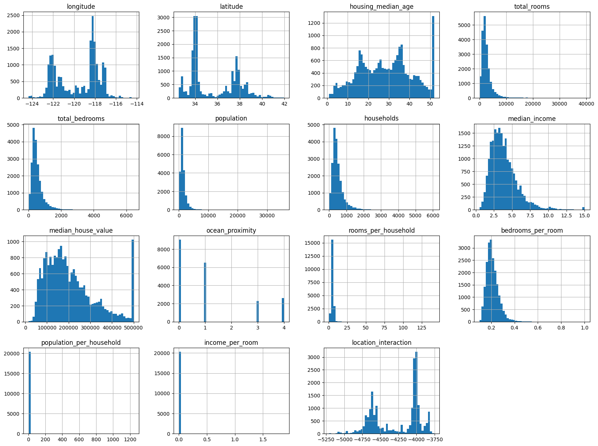
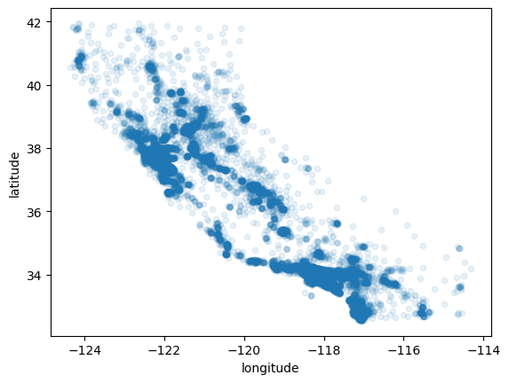
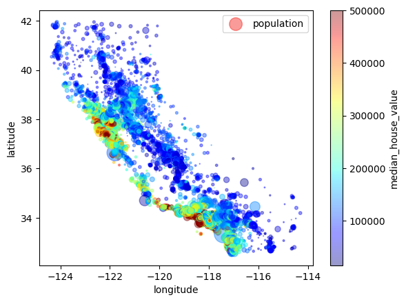
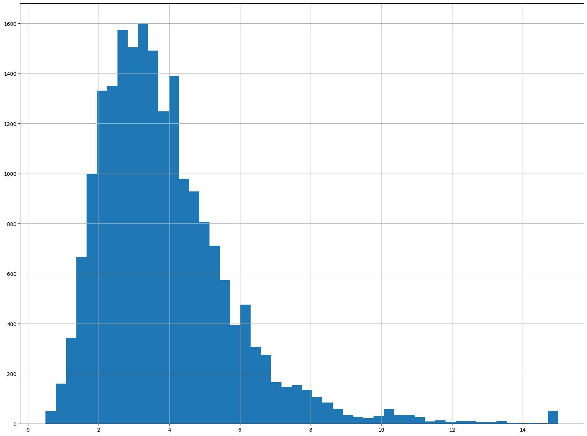
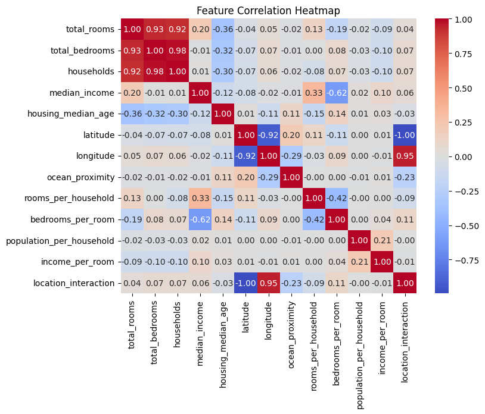
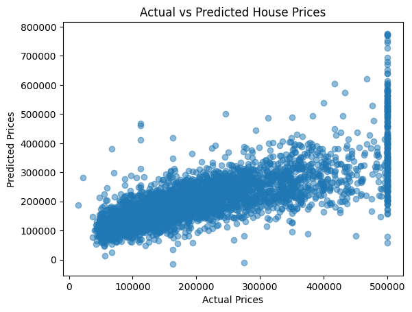

🏠 House Price Prediction using Linear Regression

📌 Project Overview

This project focuses on building a Linear Regression model to predict house prices based on various socio-economic and geographical features.

The model uses important housing characteristics such as:

- 📊 Median Income
- 🏡 Housing Age
- 📍 Location (Latitude & Longitude)
- 🏘️ Room and Household Information
- 🌊 Ocean Proximity

This project demonstrates a complete Data Analysis + Feature Engineering + Machine Learning pipeline.

---

🎯 Problem Statement

The objective is to predict the Median House Value using multiple independent variables and understand how different factors influence housing prices.

Accurate price prediction can help:

- Real estate analysis
- Market trend understanding
- Investment decision-making

---

⚙️ Project Workflow

1️⃣ Data Loading & Exploration

- Dataset loaded using Pandas
- Checked structure, data types, and missing values
- Identified missing values in "total_bedrooms"

---

2️⃣ Data Preprocessing

- Missing values removed

- Categorical feature ocean_proximity encoded using Label Encoding

- New features engineered:
  
  - rooms_per_household
  - bedrooms_per_room
  - population_per_household
  - income_per_room
  - location_interaction

Feature engineering helps improve model performance by capturing hidden relationships.

---

📊 Exploratory Data Analysis (EDA)

All visualizations are stored inside the images folder.

---

1️⃣ Overall Feature Distributions

Insights:

- Shows distribution of all important housing features
- Helps detect skewness and outliers
- Indicates the need for feature scaling

---

2️⃣ Geographical Distribution of Houses

Insights:

- Shows housing locations based on latitude and longitude
- Reveals high-density residential regions
- Useful for understanding location-based price influence

---

3️⃣ Population & Price Density Visualization

Insights:

- Color represents house price variation
- Circle size represents population
- Higher population areas show higher price concentration

---

4️⃣ Median Income Distribution

Insights:

- Median income shows a strong variation across regions
- Income is expected to be a major predictor of house prices

---

5️⃣ Feature Correlation Heatmap

Insights:

- Identifies relationships between features
- Highly correlated features were removed to avoid multicollinearity
- Helps in selecting the most important predictors

---

6️⃣ Actual vs Predicted Prices

Insights:

- Shows model prediction performance
- Points close to diagonal line indicate good predictions
- Some spread indicates prediction error and model limitations

---

🔍 Key Insights from Analysis

- Median Income is the strongest factor affecting house prices
- Location plays a significant role in price variation
- Some features showed high correlation and were removed to improve model stability
- Data scaling was necessary due to different feature ranges
- Linear relationships exist, but some non-linearity is also present

---

🤖 Model Building

Data Preparation

- Selected relevant features after correlation analysis
- Features scaled using StandardScaler
- Dataset split into:
  - 80% Training
  - 20% Testing

---

Model Training

- Model used: LinearRegression (Scikit-learn)
- Trained on scaled training data

---

📈 Model Evaluation

- Mean Squared Error (MSE): 6,062,353,703
- R² Score: 0.5567

Interpretation

- Model explains ~55% of price variation
- Indicates moderate predictive performance
- Linear model captures general trend but not complex patterns

---

🧪 Sample Predictions

The model was tested on sample house data and successfully generated price predictions for new inputs.

A user-defined prediction function was also implemented for real-time price estimation.

---

📁 Project Structure

House_Price_Linear_Regression/
│
├── housing.csv
├── House_Prediction.ipynb
├── images/
│   ├── download.png
│   ├── download_1.png
│   ├── download_2.png
│   ├── download_3.png
│   ├── download_4.png
│   └── download_5.png
└── README.md

---

🛠️ Technologies Used

- Python 🐍
- Pandas
- NumPy
- Matplotlib
- Seaborn
- Scikit-learn

---

🎓 Key Learnings

- Handling missing data and categorical encoding
- Feature engineering for improved performance
- Multicollinearity detection and removal
- Feature scaling using StandardScaler
- Model evaluation using regression metrics
- Building a real-world prediction system

---

✅ Conclusion

The Linear Regression model successfully captured the general relationship between housing features and price.

However:

- Model performance is moderate (R² ≈ 0.55)
- Some complex patterns are not captured

Future Improvements

- Decision Tree Regression
- Random Forest
- Gradient Boosting

This project demonstrates a complete end-to-end Data Science workflow, from data exploration to deployment-ready prediction logic.

---

👤 Author

Priyam Khare
MCA | Data Analytics & Machine Learning
